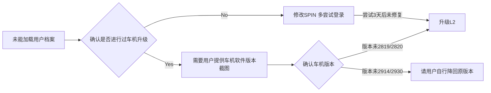

# MOS4 ME3 未能加载用户档案

##### 问题场景

用户登录车机一直报错未能加载用户档案，有登录二维码，小地球有。

##### 排查建议

【先确认用户是否进行过车机升级】

- 没有升级，修改SPIN多尝试几次登录。
- 有升级过的话，需要提供下车机软件版本截图，之后按流程图进行处理。

**ME版本对应**

| ME  | VBV      | OCU  | ICAS3     |
|:---:|:--------:|:----:|:---------:|
| ME2 | 4.5.2C   | 0196 | 0456      |
|     | 4.5.3C   | 0199 | 1498      |
|     | 4.5.3.1C | 0502 | 1498      |
|     | 4.5.5C   | 0502 | 1516      |
| ME3 | ME3.0    | 0533 | 2819／2820 |
|     | ME3.1    | 0533 | 2914      |
|     | ME3.2    | 0574 | 2930      |
|     | ME3.4    | 0574 | 2930／2944 |
